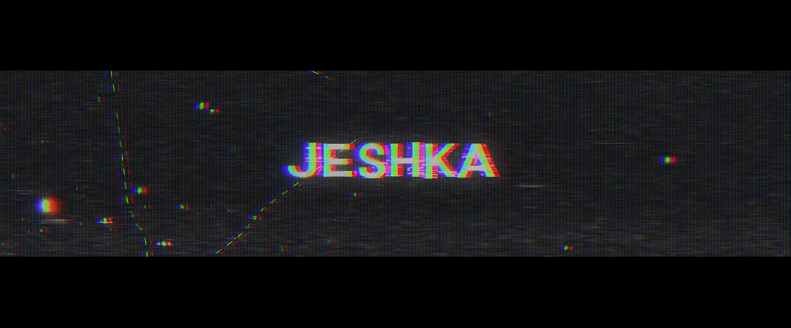

# Animation

# Jeshly: The History of Fire

> Client: 555-Jeshly, Vibenarium   
> Assignment: Demo for an animated documentary that utilizes different styles that work on a limited budget with a fast paced pipeline. Narration style was assigned to be "reminiscent of Arnold Schwarzenegger".

# Jeshka - Animated Series

> Client: Vibenarium    
> Assignment: Teaser Trailer with VHS effect in the style of a 90s cartoon.

# Marty - Animated Series

> Client: Vibenarium  
> Assignment: Teaser Trailer with VHS effect in the style of a cinematic early 2000s cartoon.
