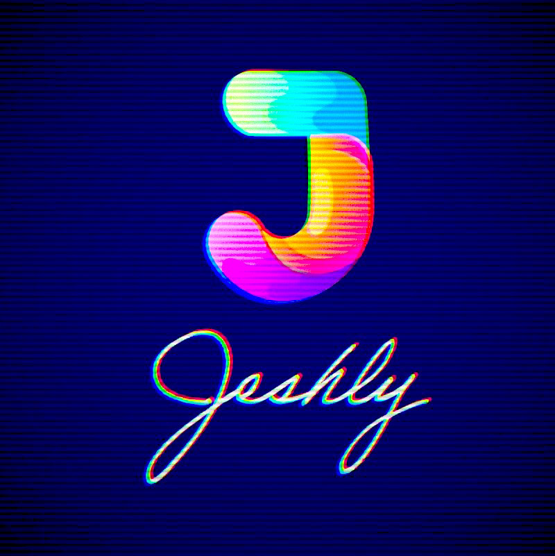
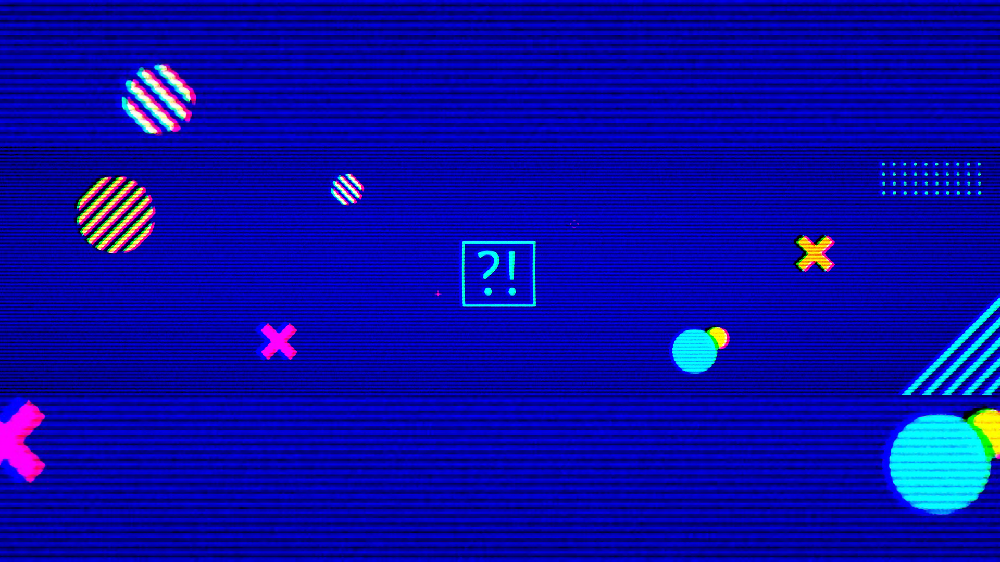
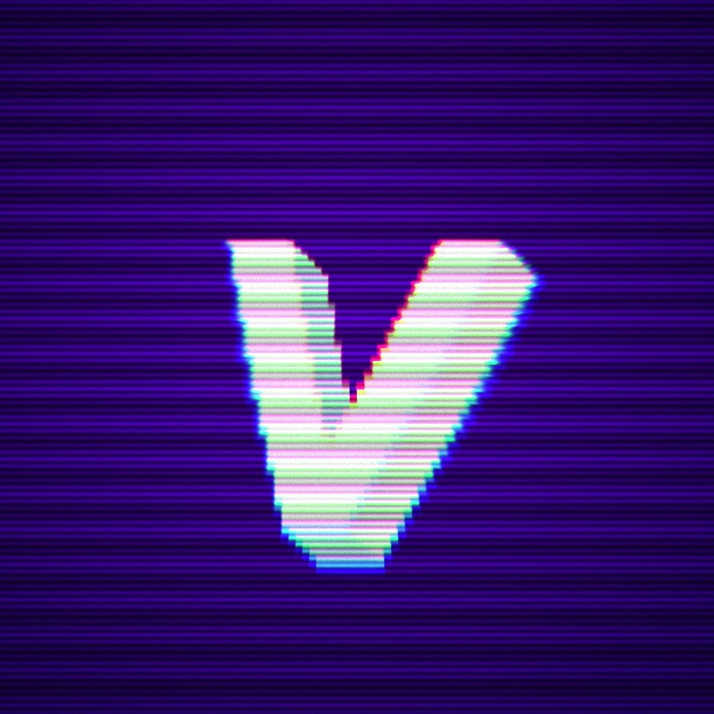
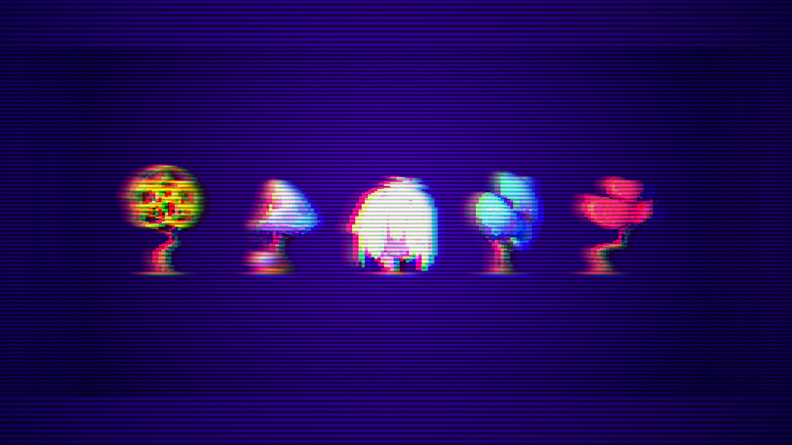
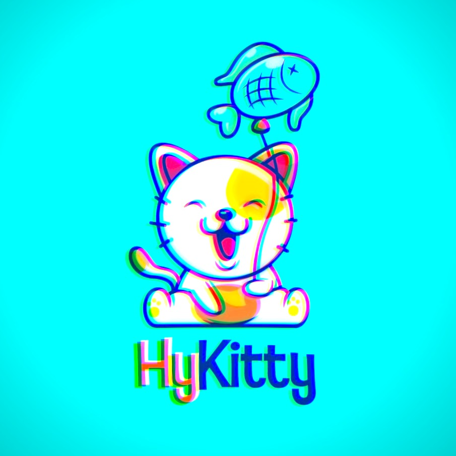
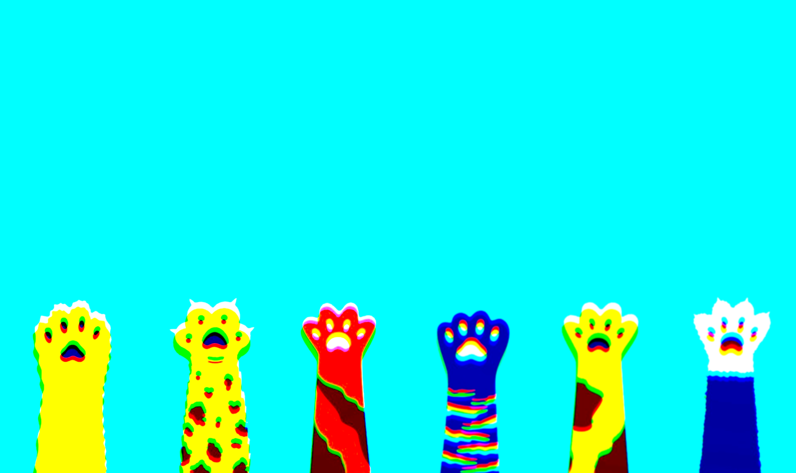

# Illustration & Graphic Design

# Jeshly - Infographics Channel

> Client: Vibenarium  
> Assignment: Logo and Banner that look like stills from a 90s TV show but feature modern graphics.

# Vibenarium - Collaborative Entertainment Platform

> Client: Vibenarium  
> Assignment: Logo and Banner that look like stills from a 90s TV show but feature modern graphics.

# HyKitty - Pet Store and YouTube Channel

> Client: HyKitty  
> Assignment: Island theme.
